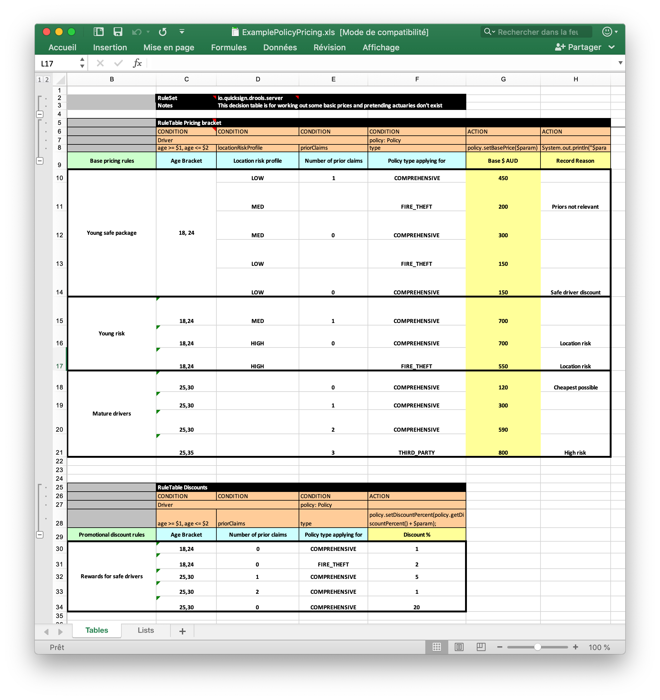

# Drools Server

## Usage

### Build

```
mvn clean install
```

This will build the fat jar, the fat shell script and install the script in `~/bin/drools-server`.

### Sample decision table and types

#### Excel sheet `doc/rules/ExamplePolicyPricing.xls`

**IMPORTANT**: The Excel sheet must import in `RuleSet` cell `D2` the model package `io.quicksign.drools.server`, it should be changed to reflect your company but must match the package exported from `Types.drl` file.



#### Fact types `doc/rules/Types.drl`

```
package io.quicksign.drools.server

declare Driver
    name : String = "Mr Joe Blogs"
    age : Integer = new Integer(30)
    priorClaims : Integer = new Integer(0)
    locationRiskProfile : String = "LOW"
end

declare Policy
    type : String = "COMPREHENSIVE";
    approved : boolean = false;
    discountPercent : int = 0;
    basePrice : int;
end
```

**IMPORTANT**: The `io.quicksign.drools.server` can be changed be must be matched by the packaged imported in the Excel file. See `RuleSet` cell `D2`.

### Start the server

Given the sample decision table and facts are in `doc/rules/` :

- Installed shell script from `~/bin`: `drools-server --drools.folder=$PWD/doc/rules`
- Shell script from `./target` dir: `./target/drools-server.sh --drools.folder=$PWD/doc/rules`
- Executable JAR: `java -Ddrools.folder=$PWD/doc/rules -jar target/drools-server-1.0-SNAPSHOT.jar`

### Test the rules

With Swagger UI :

At [http://localhost:8080/swagger-ui.html](http://localhost:8080/swagger-ui.html)

Sample facts request body :

```
[
    {
        "_type": "io.quicksign.drools.server.Driver",
        "age": 30,
        "priorClaims": 0,
        "locationRiskProfile": "LOW"
    },
    {
        "_type": "io.quicksign.drools.server.Policy"
    }
]
```


With Curl

```
curl -X POST "http://localhost:8080/" \
	-H "Content-Type: application/json" \
	-d "[{ \"_type\": \"io.quicksign.drools.server.Driver\", \"age\": 30, \"priorClaims\": 0, \"locationRiskProfile\": \"LOW\"}, { \"_type\": \"io.quicksign.drools.server.Policy\" } ]"
```

It should return the following :

```
[
    {
        "_type": "io.quicksign.drools.server.Driver",
        "age": 30,
        "priorClaims": 0,
        "locationRiskProfile": "LOW"
    },
    {
        "_type": "io.quicksign.drools.server.Policy",
        "approved": false,
        "discountPercent": 20,
        "type": "COMPREHENSIVE",
        "basePrice": 120
    }
]
```

### Experimental RFC 6902 JSON Patch support

The endpoint URL is `/_diff` :

```
curl -X POST "http://localhost:8080/_diff" \
	-H "Content-Type: application/json" \
	-d "[{ \"_type\": \"io.quicksign.drools.server.Driver\", \"age\": 30, \"priorClaims\": 0, \"locationRiskProfile\": \"LOW\"}, { \"_type\": \"io.quicksign.drools.server.Policy\" } ]"
```

It should return the following :

```
[
  {
    "op": "add",
    "path": "/1/approved",
    "value": false
  },
  {
    "op": "add",
    "path": "/1/basePrice",
    "value": 120
  },
  {
    "op": "add",
    "path": "/1/discountPercent",
    "value": 20
  },
  {
    "op": "add",
    "path": "/1/type",
    "value": "COMPREHENSIVE"
  }
]
```

NB: It is almost as heavy as the normal response so its interest needs to be confirmed.
