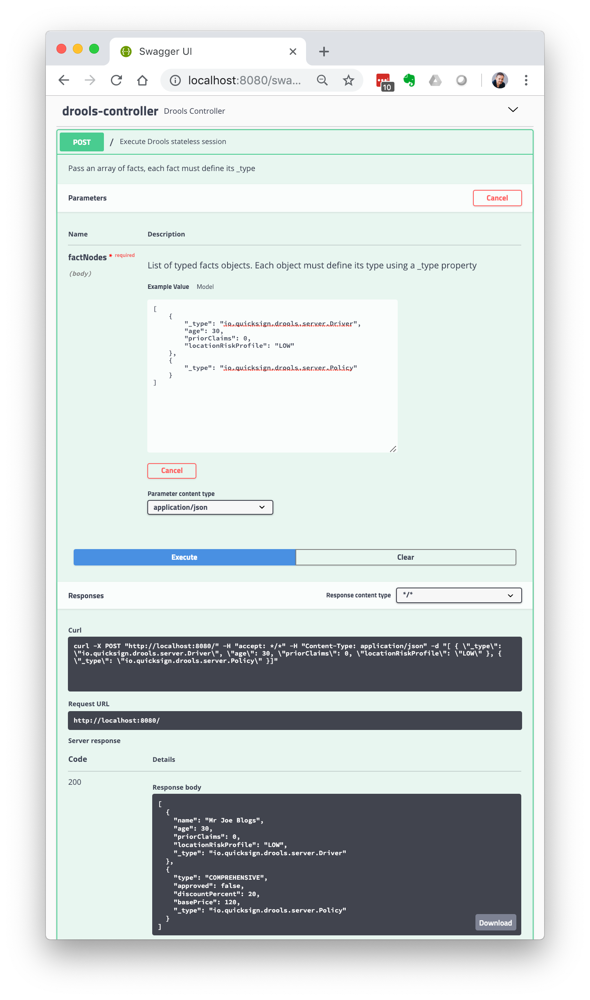

# Drools Server

## Usage

### Build

```
mvn clean package
```

### Sample decision table and types

#### Excel sheet `doc/rules/ExamplePolicyPricing.xls`


#### Fact types `doc/rules/Types.drl`

```
package io.quicksign.drools.server

declare Driver
    name : String = "Mr Joe Blogs"
    age : Integer = new Integer(30)
    priorClaims : Integer = new Integer(0)
    locationRiskProfile : String = "LOW"
end

declare Policy
    type : String = "COMPREHENSIVE";
    approved : boolean = false;
    discountPercent : int = 0;
    basePrice : int;
end
```

### Start the server

Given the sample decision table and facts are in `doc/rules/` :

- Shell script: `./target/drools-server.sh --drools.folder=$PWD/doc/rules`
- Executable JAR: `java -Ddrools.folder=$PWD/doc/rules -jar target/drools-server-1.0-SNAPSHOT.jar`

### Test the rules

With Swagger UI :

At [http://localhost:8080/swagger-ui.html](http://localhost:8080/swagger-ui.html)

Sample input facts request body :

```
[
    {
        "_type": "io.quicksign.drools.server.Driver",
        "age": 30,
        "priorClaims": 0,
        "locationRiskProfile": "LOW"
    }
]
```

Sample output fact type :

```
io.quicksign.drools.server.Driver
```



With Curl

```
curl -X POST "http://localhost:8080/?outputType=io.quicksign.drools.server.Policy" \
	-H "Content-Type: application/json" \
	-d "[{ \"_type\": \"io.quicksign.drools.server.Driver\", \"age\": 30, \"priorClaims\": 0, \"locationRiskProfile\": \"LOW\"}]"
```

It should return the following :

```
{"approved":false,"discountPercent":20,"type":"COMPREHENSIVE","basePrice":120}
```
